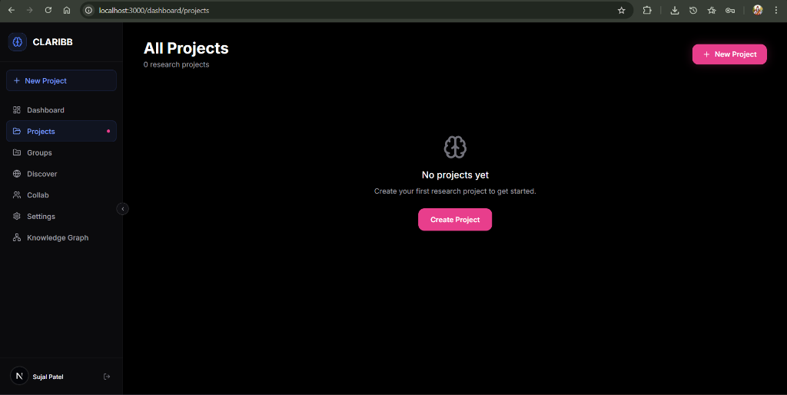
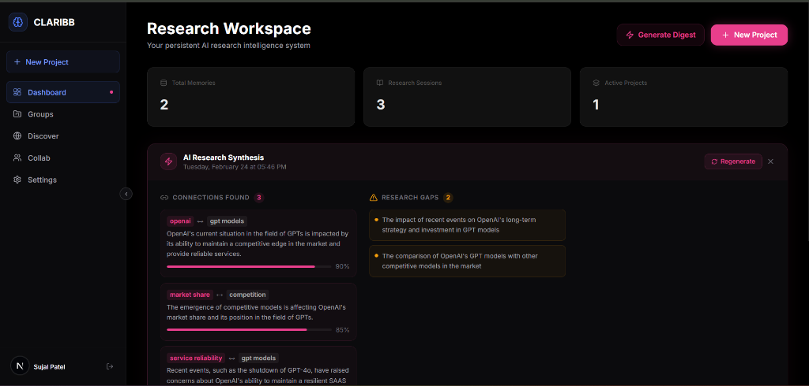

# Claribb.AI — Multi-Agent Research Intelligence

**SPEEDRUN 2026 AI Hackathon Submission**

### Landing Page


### Research Workspace


🎬 **[Watch Demo Video](https://drive.google.com/file/d/1uDnGTOHsN6e65ROc4-BPSzwYsmc-TOee/view?usp=sharing)**

Claribb.AI is a persistent, memory-driven AI research workspace that **remembers everything** across sessions, surfaces relevant context automatically, and deploys 4 specialized agents in parallel on every query.

> _The AI that never forgets your research._

---

## 🧠 What Claribb.AI does

| Feature | Description |
|---|---|
| **Persistent Semantic Memory** | Every conversation is chunked, embedded with `text-embedding-3-small`, and stored in pgvector. Claribb.AI retrieves the right memories for every question. |
| **4-Agent Orchestration** | Recall · Explorer · Critique · Connector — all run in parallel on every message |
| **Session Continuity** | Each session is summarized by GPT-4o-mini. Open questions carry forward to the next session. |
| **Knowledge Graph** | Concepts and relationships are auto-extracted and visualized in an interactive React Flow graph |
| **Research Digests** | Proactive AI insights: new connections, detected gaps, open questions |
| **Streaming Responses** | Real-time SSE streaming with per-agent status indicators |
| **Collab Servers** | Real-time collaborative research rooms with live chat + Claribb.AI group AI assistance |

---

## 🏗 Architecture

```
User Message
    │
    ▼
┌─────────────────────────────────────────┐
│         Agent Orchestrator              │
│  ┌──────────┐  ┌──────────┐            │
│  │  RECALL  │  │ EXPLORER │  (parallel) │
│  │ pgvector │  │ web srch │            │
│  └──────────┘  └──────────┘            │
│  ┌──────────┐  ┌──────────┐            │
│  │ CRITIQUE │  │CONNECTOR │  (parallel) │
│  │ counter  │  │ concept  │            │
│  │ -args    │  │ linking  │            │
│  └──────────┘  └──────────┘            │
└─────────────────────────────────────────┘
    │
    ▼
GPT-4o-mini (with rich context bundle)
    │
    ▼
SSE Stream → Frontend
    │
    ▼
Post-processing (async):
  • Store response as memory chunk
  • Extract + upsert concepts & relationships
  • Update session message count
```

---

## ⚡ Tech Stack

- **Frontend**: Next.js 15 (App Router), React 19, Framer Motion, React Flow
- **Backend**: Next.js API Routes (Node.js runtime), Server-Sent Events
- **AI**: Groq (llama-3.3-70b-versatile), Cohere (embeddings)
- **Database**: Supabase (PostgreSQL + RLS + Realtime)
- **Auth**: Supabase Auth
- **Styling**: Custom CSS variables (dark theme)

---

## 🚀 Setup

### 1. Install dependencies
```bash
npm install
```

### 2. Set up environment variables
```bash
cp .env.local.example .env.local
# Fill in your Supabase and AI API keys
```

### 3. Set up Supabase database
1. Create a new Supabase project at [supabase.com](https://supabase.com)
2. Run `supabase/complete_setup.sql` in the **SQL Editor** (creates all tables, RLS policies, and triggers in one shot — no pgvector extension required)

### 4. Run locally
```bash
npm run dev
```

Open [http://localhost:3000](http://localhost:3000)

---

## 🗺 Routes

| Route | Description |
|---|---|
| `/` | Landing page |
| `/auth` | Sign in / Sign up |
| `/dashboard` | Project overview + stats |
| `/dashboard/workspace/[projectId]` | Research chat workspace |
| `/dashboard/graph/[projectId]` | Knowledge graph visualization |
| `/dashboard/collab` | Collaborative research servers |
| `/dashboard/settings` | User settings |

---

## 🔌 API Routes

| Endpoint | Method | Description |
|---|---|---|
| `/api/chat` | POST | Streaming chat with agent orchestration |
| `/api/memory` | GET/POST | Memory retrieval and storage |
| `/api/projects` | GET/POST/DELETE | Project CRUD |
| `/api/sessions` | GET/POST/PATCH | Session management + AI summarization |
| `/api/graph` | GET | Knowledge graph nodes + edges |
| `/api/digest` | GET/POST | Proactive research digest generation |
| `/api/servers` | GET/POST/PATCH | Collab server management |
| `/api/servers/[serverId]/chat` | POST | Group AI chat in a collab server |
| `/api/servers/[serverId]/messages` | GET/POST | Server message history |

---

## 🤖 The 4 Agents

### 🔵 Recall Agent
Searches your semantic memory bank using cosine similarity. Retrieves the top-8 most relevant memory chunks from your project's store.

### 🟦 Explorer Agent
When recall confidence is below 0.72, triggers a web search (Tavily API) to augment with fresh information.

### 🟡 Critique Agent
Identifies counterarguments, assumptions, and knowledge gaps in your query. Especially useful in **Critique Mode**.

### 🟢 Connector Agent
Uses your existing concepts to find non-obvious connections between ideas across different research sessions.

---

## 💡 Hackathon Notes

Built for **SPEEDRUN 2026 AI Hackathon** — a multi-agent system that compounds knowledge across research sessions. The core thesis: _every AI interaction should make the next one smarter_.

Key innovations:
- **Compound memory**: the system gets more intelligent the more you use it
- **Session continuity**: open questions carry forward automatically
- **Parallel agents**: all 4 agents run simultaneously, not sequentially
- **Knowledge graph auto-building**: concepts extracted from every conversation
- **Collaborative research**: real-time collab servers with group AI assistance
